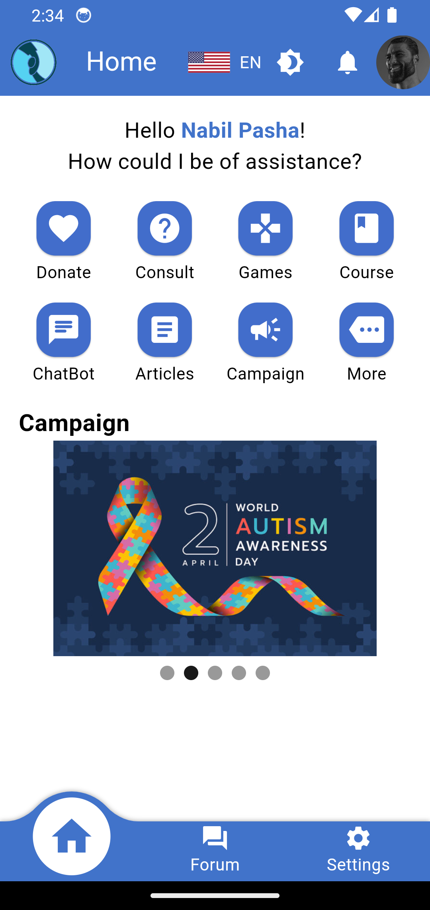

# NeuroParenting

## Introduction

>“It is not our differences that divide us. It is our inability to recognize, accept, and celebrate those differences.” –   Audre Lorde

Welcome to NeuroParenting, an app designed to provide support and resources for parents who are raising neurodivergent children. Whether your child has autism, ADHD, dyslexia, or any other neurodivergent condition. With feature such as Games, Forum, Course and much more, this app aims to be a valuable tool to assist you in navigating the challenges and joys of parenting.

## Feature
1. Forum, a supportive online forum designed for parents of neurodivergent children and experienced psychologists specializing in neurodevelopmental disorders. Our community is a safe and empathetic space where parents can come together to share experiences, seek advice, and build a network of support while benefiting from the professional insights provided by expert psychologists. another.

2. Articles, connects you to helpful articles from trusted sources outside the app. Get practical tips, the latest research, and personal stories covering various aspects of neurodivergence.NeuroParenting facilitates your exploration, ensuring that valuable information and support are readily accessible with just a tap.

3. Consult, Engage in real-time conversations with experienced psychologists, make a personalized consultationsz allowing you to seek guidance, ask questions, or discuss concerns directly.

4. Games, designed for neurodivergent children, these interactive games turn education into a fun and engaging experience. Each game is crafted to stimulate cognitive skills, creativity, and social interaction. Watch as your child learns and grows. With NeuroParenting, education becomes an adventure, making every moment a chance to play and thrive.

5. Course, These courses blend education and play, offering an interactive learning experience. From exciting lessons to vibrant visuals, each course is crafted to engage young minds. Watch as your child discovers new concepts and hones essential skills. 

6. Chatbot, This interactive feature is designed to provide quick answers to your questions, offer helpful tips, and guide you through various aspects of neurodiverse parenting. Seamlessly integrated into the app, our Chatbot is available 24/7, ensuring support is just a message away.

7. Campaign, consist of positive affirmation and encouragement for both the parent and children to take a step forward.

8. Donate, join us in our mission to increase the quality of education. Every donation, big or small, contributes to creating a positive impact. With a few clicks, you can be part of something meaningful, making the world a better place for everyone.

## User Interface
1. Extremely adaptable and responsive UI.
2. Perfectly wrapped expandable widget in flex widget.
3. Ultra-comfort theme changing.
4. Wide variety of features
5. Accessible in two languages, English and Indonesian Language

### Home Page
Here after you successfully login, you got variety of feature to use...

  

###

## Downloads (Current Release)

Download the latest version of NeuroParenting according to your Android device's architecture type:
- [Fat Apk](https://github.com/mfazrinizar/NeuroParenting/releases/download/v0.0.1/NeuroParenting-app-release.apk) (Fat APK, if you don't know your Android architecture)
- [Arm64-v8a](https://github.com/mfazrinizar/NeuroParenting/releases/download/v0.0.1/NeuroParenting-app-arm64-v8a-release.apk) (APK for arm64-v8a)
- [Armeabi-v7a](https://github.com/mfazrinizar/NeuroParenting/releases/download/v0.0.1/NeuroParenting-app-armeabi-v7a-release.apk) (APK for armeabi-v7a or arm32)
- [x86_64](https://github.com/mfazrinizar/NeuroParenting/releases/download/v0.0.1/NeuroParenting-app-x86_64-release.apk) (APK for x86_64)

## About Us
Hey There! We're a group of four students developing NeuroParenting from Sriwijaya University. Each of our role is :
1. MUHAMMAD ZHAFRAN as a Hustler
2. AISYAH FATIMAH as a Hipster
3. M. FAZRI NIZAR as a Hacker
4. FACHRY GHIFARY as a Hacker

Follow us on our social media :
Instagram :
Youtube :
Facebook :
Twitter :
